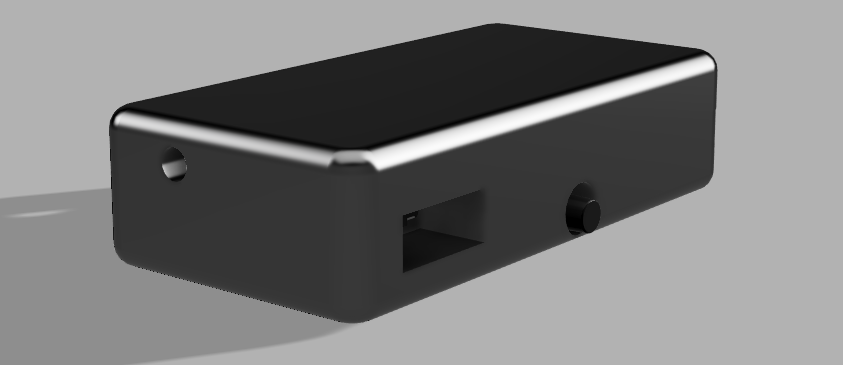
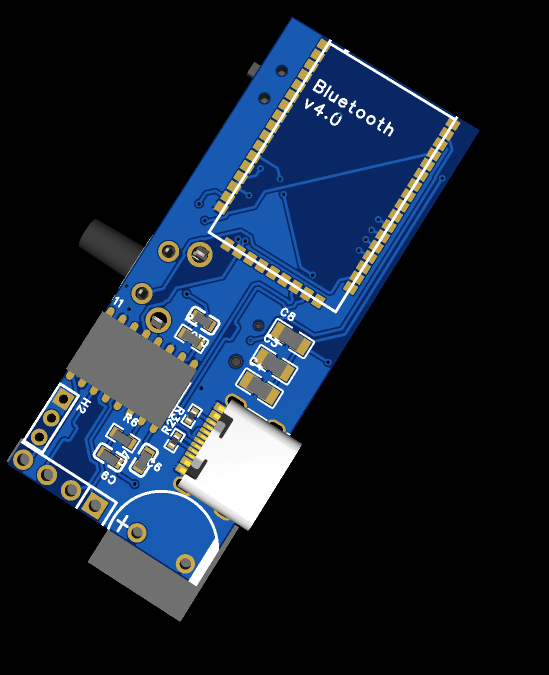
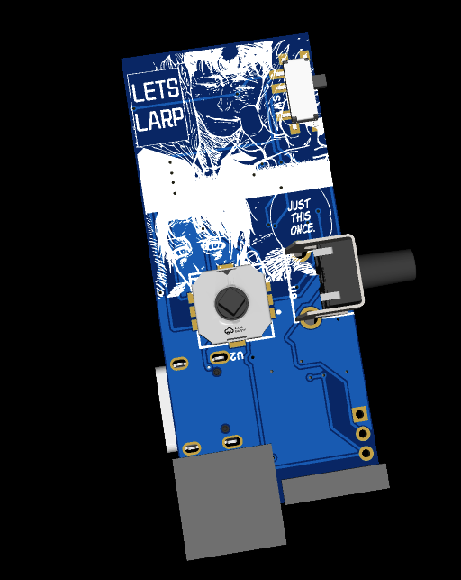
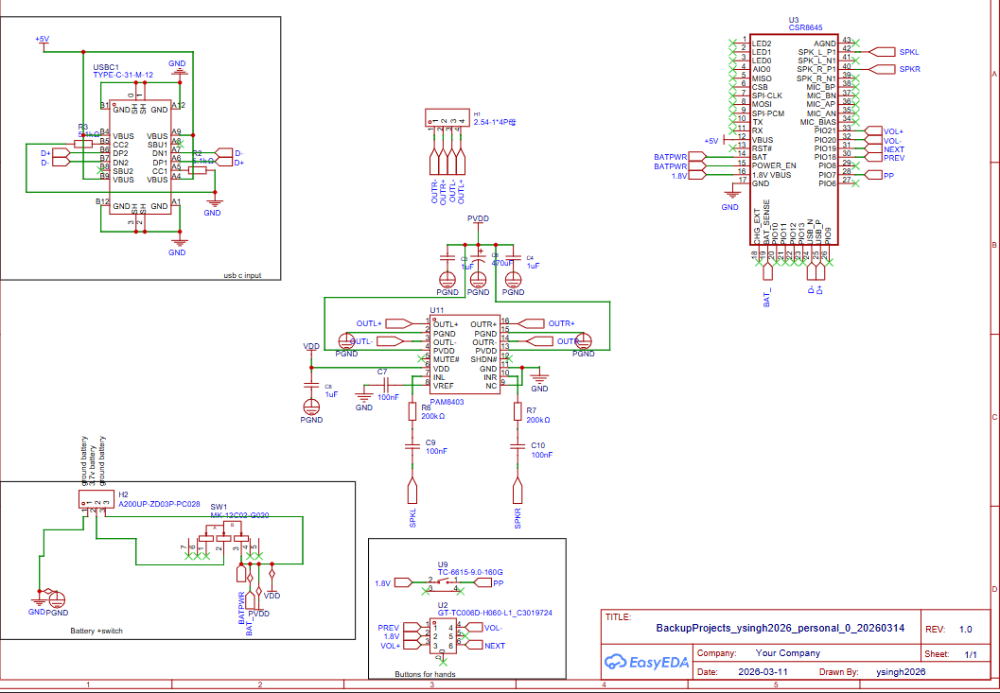

# Beanie Headphones - Bone Conduction Audio System
A DIY bone conduction headphone system integrated into a beanie using CSR8646 Bluetooth audio SoC and a compact amplifier. Listen to music and calls while keeping your ears free and staying warm!

## Overview
Beanie Headphones are wireless bone conduction headphones that stay snugly inside your beanie. The system uses Bluetooth connectivity via the CSR8646 chip to stream audio wirelessly, which is then amplified and delivered through bone conduction transducers embedded in the beanie fabric.

**Key Features:**
- Wireless Bluetooth connectivity (CSR8646)
- Bone conduction audio - no earbuds or speakers in ears
- Integrated into comfortable beanie design
- Long battery life
- Lightweight and discreet
- Works in cold weather without earmuffs interference

## The System Design
The core system consists of three main components:

1. **Bluetooth Audio SoC (CSR8646)** - Handles wireless audio reception and processing
2. **Audio Amplifier** - Amplifies the signal to drive bone conduction transducers
3. **Bone Conduction Transducers** - Mounted in beanie to transmit vibrations through skull

The transducers are positioned at the temples to vibrate against the skull, transmitting sound waves directly to the inner ear while leaving the external ear canal open for ambient awareness.

## Bill of Materials

**View the complete BOM:** [totalbom.csv](totalbom.csv)

|Item                          |Qty.|Unit Price|Ext. Price|Link                                              |
|------------------------------|----|-----------|-----------|----------------------------------------------------|
|CSR8645 Bluetooth Audio SoC   |1   |$5.99      |$5.99      |[Alibaba](https://www.alibaba.com/product-detail/CSR8645-4-0-Low-energy-Bluetooth_1601361718339.html)|
|1uF 50V Ceramic Capacitor     |3   |$0.0138    |$0.28      |[LCSC](https://www.lcsc.com/product-detail/C28323.html)|
|100nF 50V Ceramic Capacitor   |3   |$0.0028    |$0.28      |[LCSC](https://www.lcsc.com/product-detail/C14663.html)|
|200kΩ Thick Film Resistor     |2   |$0.0014    |$0.14      |[LCSC](https://www.lcsc.com/product-detail/C105574.html)|
|PAM8403 Audio Amplifier       |1   |$0.2669    |$1.33      |[LCSC](https://www.lcsc.com/product-detail/C5122557.html)|
|470µF 35V Electrolytic Cap    |1   |$0.1710    |$0.86      |[LCSC](https://www.lcsc.com/product-detail/C88732.html)|
|USB-C Connector               |1   |$0.1829    |$0.91      |[LCSC](https://www.lcsc.com/product-detail/C165948.html)|
|Slide Switch                   |1   |$0.1215    |$0.61      |[LCSC](https://www.lcsc.com/product-detail/C963206.html)|
|Navigation Switch Joystick     |1   |$0.4102    |$0.41      |[LCSC](https://www.lcsc.com/product-detail/C3019724.html)|
|Tactile Switch                 |1   |$0.0374    |$1.50      |[LCSC](https://www.lcsc.com/product-detail/C6575016.html)|
|Bone Conduction Transducers   |2   |$8.95      |$17.90     |[Alibaba](https://www.alibaba.com/)|
|3.7V Lipo Battery             |1   |$4.50      |$4.50      |[Alibaba](https://www.alibaba.com/product-detail/3-7v-Lipo-Li-Ion-Battery_62343732082.html)|
|Bone Transducers Shipping     |1   |-          |$5.80      |Alibaba Shipping|
|Shipping & Handling Fee       |1   |-          |$12.01     |LCSC Components|
|PCB + Shipping                |1   |$5.22      |$5.22      |[JLCPCB](https://www.jlcpcb.com)|

**Estimated Total: $57.74 USD**

## Hardware Assembly

1. **PCB Design** - Create custom PCB with CSR8646, PAM8403, and power management circuits
2. **Bone Transducer Mounting** - Secure transducers at temple positions inside beanie with vibration-damping material
3. **Battery Integration** - Mount rechargeable Li-Po cell in inner beanie band for balance and comfort
4. **Control Panel** - Power button and potential future button modules sewn into accessible beanie area
5. **Wiring** - Connect all components with flexible, strain-relieved wiring

## Key Specifications

- **Bluetooth Version:** 5.0
- **Range:** ~10-15 meters (open space)
- **Battery Life:** ~6-8 hours (depending on usage and battery capacity)
- **Frequency Response:** 100 Hz - 10 kHz (bone conduction limited)
- **Power Output:** 6W combined (2x3W amplifier)
- **Weight:** ~150-180g (including beanie)

## Design Notes

- The CSR8646 handles all Bluetooth audio codec processing
- The PAM8403 amplifier provides clean Class D amplification with minimal power draw
- Bone conduction offers natural sound while allowing situational awareness
- Transducer placement at temples provides optimal bone vibration coupling
- Integrated rechargeable battery with USB charging adds convenience

## Future Improvements (v2)

- On-beanie touch controls for play/pause and volume
- Gesture recognition for call acceptance
- Noise-canceling microphone for hands-free calling
- Extended battery life (higher capacity cell or dual cells)
- Multi-device pairing
- Better impedance matching for clearer audio
- Waterproof sealing for weather resistance

---

*Built for comfort, style, and seamless audio.*
